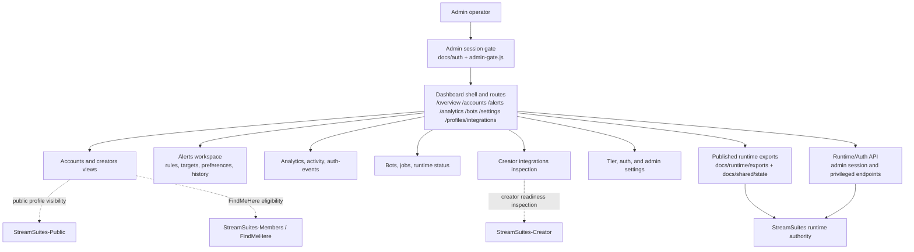

# StreamSuites-Dashboard

Admin-facing StreamSuites surface deployed to Cloudflare Pages at `https://admin.streamsuites.app`.

## Release State

- README state prepared for `v0.4.2-alpha`.
- The active admin web surface is Cloudflare Pages hosted.
- The repo-root admin shell now acts as the canonical Pages entry point, matching the working Creator/Public single-root routing model, while shared assets and published exports still live under `docs/`.
- This repo consumes runtime exports for visibility and uses Auth API/runtime endpoints for privileged operations; it does not own runtime execution.

## Scope & Authority

- This repo is the admin/operator web shell, not the runtime itself.
- Admin access is privileged, but runtime execution, Auth decisions, version/build ownership, and exported state remain runtime-owned in `StreamSuites`.
- The dashboard is allowed to call privileged runtime/Auth endpoints, yet it still consumes those contracts rather than redefining them.
- Runtime-exported version/build files are mirrored under `docs/runtime/exports/`, while published state snapshots land under `docs/shared/state/`.

## Repo-Scoped Flowchart



## Current Admin Surface Model

- Clean path-based admin routes are the primary navigation model, replacing older hash-fragment and partial-only dependence for normal use.
- Root and `docs/` rewrite manifests preserve deep links for routes such as `/overview`, `/accounts`, `/profiles`, `/analytics`, `/alerts`, `/notifications`, `/settings`, `/creator-stats`, `/integrations/...`, and other admin views, but the repo root is now the authoritative shell so deep links do not depend on a `/docs/index.html` compatibility hop.
- Creator integrations now have a dedicated admin route at `/profiles/integrations`, backed by runtime/Auth-admin inspection endpoints for creator-capable posture, platform readiness, trigger foundation, and bot deploy eligibility.
- Admin account investigation now also supports a dedicated `user_code` route at `/users/{user_code}` for exhaustive single-account inspection across identity, auth posture, creator readiness, integrations, and trigger footing.
- Admin account inspection now exposes authoritative public-profile state, including canonical slug, creator-capable vs viewer-only posture, StreamSuites and FindMeHere visibility or eligibility, slug aliases, canonical URLs, and reserved media fields including background image URL.
- The current routing and auth cutover work is reflected in fail-closed Auth API session gating, Cloudflare Pages-safe login routing, and current route compatibility handling.
- Alerts now live in a dedicated admin route and sidebar destination, separate from Analytics, while still consuming the same backend-owned alert settings, rules, targets, and history APIs.
- The Alerts workspace exposes backend-authored notification title/message fields, a backend-driven placeholder picker, a local live preview, and clearer delivery/status terminology without changing backend contracts.
- Alert preferences continue to manage backend-authored quiet hours, timezone-aware overnight suppression, and per-destination enabled/minimum-severity controls from the dedicated Alerts workspace.

## Hosting and Routing

- `_redirects` now mirrors the Creator/Public single-root SPA rewrite model: known admin routes resolve to the repo-root `index.html`, while shared asset directories still map into `docs/`.
- `docs/_redirects` remains as the docs-root compatibility manifest and now only rewrites known admin routes so invalid paths still fall through to `404.html`.
- `functions/[[path]].js` keeps a Pages runtime fallback for known admin SPA routes and now prefers the repo-root shell before the legacy `docs/` shell.
- Runtime export metadata is consumed from local published copies under `docs/runtime/exports/`.

## Cross-Repo Orientation

- Top-level authority map: [StreamSuites runtime README](https://github.com/BSMediaGroup/StreamSuites)
- Creator-surface detail: [StreamSuites-Creator README](https://github.com/BSMediaGroup/StreamSuites-Creator)
- Public-surface detail: [StreamSuites-Public README](https://github.com/BSMediaGroup/StreamSuites-Public)
- FindMeHere detail: [StreamSuites-Members README](https://github.com/BSMediaGroup/StreamSuites-Members)

## Repo Tree (Abridged, Accurate)

```text
StreamSuites-Dashboard/
├── .github/
│   └── workflows/
│       └── pages.yml
├── .vscode/
│   ├── launch.json
│   └── settings.json
├── 404.html
├── _redirects
├── BUMP_NOTES.md
├── DASHBOARD_AUDIT_REPORT.md
├── functions/
│   └── [[path]].js
├── README.md
├── changelog/
│   ├── changelog.runtime.json
│   └── v0.4.2-alpha.md
├── dev-notes/
│   ├── compatibility.md
│   ├── decisions.md
│   └── roadmap.md
├── docs/
│   ├── _redirects
│   ├── 404.html
│   ├── index.html
│   ├── auth/
│   │   ├── index.html
│   │   ├── login.html
│   │   └── success.html
│   ├── css/
│   │   ├── base.css
│   │   ├── components.css
│   │   ├── layout.css
│   │   ├── overrides.css
│   │   ├── status-widget.css
│   │   ├── theme-dark.css
│   │   └── updates.css
│   ├── data/
│   │   ├── admin_activity.json
│   │   ├── changelog.dashboard.json
│   │   ├── creators.json
│   │   ├── dashboard_state.json
│   │   ├── integrations.json
│   │   ├── jobs.json
│   │   ├── notifications.json
│   │   ├── permissions.json
│   │   ├── platforms.json
│   │   ├── rate_limits.json
│   │   ├── roadmap.json
│   │   ├── runtime_snapshot.json
│   │   └── telemetry/
│   ├── js/
│   │   ├── accounts.js
│   │   ├── admin-auth.js
│   │   ├── admin-gate.js
│   │   ├── admin-login.js
│   │   ├── admin-routes.js
│   │   ├── alerts.js
│   │   ├── analytics.js
│   │   ├── analytics-alerting.js
│   │   ├── app.js
│   │   ├── bots.js
│   │   ├── creator-integrations.js
│   │   ├── creators.js
│   │   ├── notifications.js
│   │   ├── overview.js
│   │   ├── settings.js
│   │   ├── state.js
│   │   ├── user-detail.js
│   │   └── utils/
│   │       └── country-flags.js
│   ├── runtime/
│   │   └── exports/
│   │       ├── meta.json
│   │       ├── runtime_snapshot.json
│   │       ├── version.json
│   │       └── telemetry/
│   ├── shared/
│   │   ├── data/
│   │   │   └── country_centroids.json
│   │   ├── state/
│   │   │   ├── live_status.json
│   │   │   ├── quotas.json
│   │   │   ├── runtime_snapshot.json
│   │   │   └── telemetry/
│   │   └── suspension/
│   ├── support/
│   │   ├── index.html
│   │   └── views/
│   ├── tools/
│   │   ├── index.html
│   │   └── views/
│   └── views/
│       ├── accounts.html
│       ├── alerts.html
│       ├── analytics.html
│       ├── bots.html
│       ├── creator-integrations.html
│       ├── creators.html
│       ├── jobs.html
│       ├── notifications.html
│       ├── overview.html
│       ├── settings.html
│       ├── user-detail.html
│       └── platforms/
├── runtime/
│   ├── version.py
│   └── exports/
│       ├── changelog.json
│       ├── changelog.runtime.json
│       ├── version.json
│       └── admin/
│           └── donations/
├── schemas/
│   ├── creators.schema.json
│   ├── jobs.schema.json
│   ├── permissions.schema.json
│   ├── quotas.schema.json
│   ├── services.schema.json
│   ├── triggers.schema.json
│   └── platform/
├── shared/
│   └── state/
│       ├── admin_activity.json
│       └── telemetry/
├── tmp/
│   └── [temp output]
└── index.html
```
