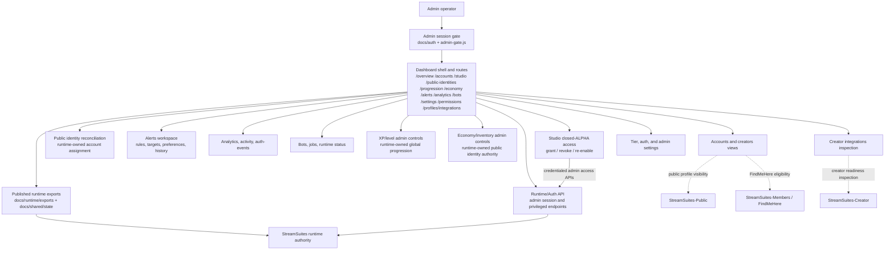

# StreamSuites-Dashboard

Admin-facing StreamSuites surface deployed to Cloudflare Pages at `https://admin.streamsuites.app`.

## Release State

- README state prepared for `v0.5.0-alpha`.
- The active admin web surface is Cloudflare Pages hosted.
- The repo-root admin shell now acts as the canonical Pages entry point, matching the working Creator/Public single-root routing model, while shared assets and published exports still live under `docs/`.
- The deploy workflow now builds a root-style publish artifact into `dist/` instead of shipping the raw `docs/` tree directly, so the published shell, fallback files, and asset paths all resolve from the same root.
- This repo consumes runtime exports for visibility and uses Auth API/runtime endpoints for privileged operations; it does not own runtime execution.
- The authenticated Admin shell includes `/studio` for Runtime/Auth-owned StreamSuites Studio closed-ALPHA tester access management; the Dashboard does not own Studio grants or capacity.
- Cloudflare deep-link handling now avoids invalid wildcard-to-shell rewrites. The route manifests use exact admin shell paths plus a single dynamic `/users/:user_code` placeholder, which Cloudflare/Wrangler accepts without discarding the rules as loop candidates.

## Studio-first operator design system

- `docs/css/studio-first-system.css` is staged into the root Pages artifact and loads last for the canonical shell, compatibility shell, 404, login, and auth-success surfaces. It retains the Admin Dashboard's existing dark muted graphite/blue palette while refining typography, dense tables, forms, dialogs, severity/status chips, destructive emphasis, focus rings, narrow table containment, and reduced-motion behavior.
- Tektur is limited to product identity and major operator titles, Geist Sans covers dense navigation, controls, forms, tables, and dialogs, and IBM Plex Mono covers version/build data, statuses, permissions, IDs, timestamps, and telemetry. The repo-local sources are `docs/assets/fonts/Tektur-VariableFont_wdth,wght.ttf`, `docs/assets/fonts/Geist-{Light,Regular,Medium,SemiBold,Bold,ExtraBold}.ttf`, and `docs/assets/fonts/mono/IBMPlexMono-{Light,Regular,Medium,SemiBold,Bold}.ttf`.
- Font hashes match the approved read-only Public sources. Genuine Geist and IBM Plex Mono licenses remain at `docs/assets/fonts/GEISTMONOOFL.txt` and `docs/assets/fonts/mono/IBMPLEXMONOOFL.txt`; a genuine local Tektur license file remains unavailable and blocks publication of that font.
- Operator metadata now describes the Dashboard as the privileged Runtime/Auth client across Studio access, accounts, permissions, alerts, audit, telemetry, and system status. Authentication, CSRF assumptions, privileged endpoints, confirmations, tables, charts, filters, pagination, routes, version authority, and exports are unchanged.
- The new stylesheet is listed in the repository tree below. Existing validation uses `node --test tests/*.test.mjs` and `powershell -File scripts/build-pages-artifact.ps1`.

## Scope & Authority

- This repo is the admin/operator web shell, not the runtime itself.
- Admin access is privileged, but runtime execution, Auth decisions, version/build ownership, and exported state remain runtime-owned in `StreamSuites`.
- The dashboard is allowed to call privileged runtime/Auth endpoints, yet it still consumes those contracts rather than redefining them.
- Studio grants, the 25 active invited non-admin tester cap, automatic admin eligibility, eligibility checks, audit data, and access decisions remain Runtime/Auth-owned. Admin accounts do not consume invited tester slots.
- Runtime-exported version/build files are mirrored under `docs/runtime/exports/`, while published state snapshots land under `docs/shared/state/`.

## Repo-Scoped Flowchart


```mermaid
flowchart TD
    Admin["Admin operator"] --> Gate["Admin session gate<br/>docs/auth + admin-gate.js"]
    Gate --> Shell["Dashboard shell and routes<br/>/overview /accounts /studio /public-identities /progression /economy /alerts /analytics /bots /settings /permissions /profiles/integrations"]

    Shell --> Accounts["Accounts and creators views"]
    Shell --> PublicIdentities["Public identity reconciliation<br/>runtime-owned account assignment"]
    Shell --> Alerts["Alerts workspace<br/>rules, targets, preferences, history"]
    Shell --> Analytics["Analytics, activity, auth-events"]
    Shell --> Bots["Bots, jobs, runtime status"]
    Shell --> Progression["XP/level admin controls<br/>runtime-owned global progression"]
    Shell --> Economy["Economy/inventory admin controls<br/>runtime-owned public identity authority"]
    Shell --> Integrations["Creator integrations inspection"]
    Shell --> Studio["Studio closed-ALPHA access<br/>grant / revoke / re-enable"]
    Shell --> Settings["Tier, auth, and admin settings"]

    Shell --> RuntimeExports["Published runtime exports<br/>docs/runtime/exports + docs/shared/state"]
    Shell --> Auth["Runtime/Auth API<br/>admin session and privileged endpoints"]
    RuntimeExports --> Runtime["StreamSuites runtime authority"]
    Auth --> Runtime

    Accounts -. public profile visibility .-> Public["StreamSuites-Public"]
    Accounts -. FindMeHere eligibility .-> Members["StreamSuites-Members / FindMeHere"]
    Integrations -. creator readiness inspection .-> Creator["StreamSuites-Creator"]
    Studio -->|credentialed admin access APIs| Auth
```

## Current Admin Surface Model

- Clean path-based admin routes are the primary navigation model, replacing older hash-fragment and partial-only dependence for normal use.
- The admin dashboard now includes a dedicated `/permissions` route under System for authoritative developer dashboard access policy inspection and editing, while keeping StreamSuites Auth API as the sole permission authority.
- The `/approvals` workspace now also acts as the first admin intake surface for developer-console feedback submissions, beta applications, and authenticated developer reports while still consuming runtime-owned review data.
- The `/approvals` workspace also now reviews runtime-owned public authority claim, assignment, issue, and removal requests through `GET/PATCH /api/admin/public/authority/requests*`, with operator wording that stays explicit about review-state changes versus downstream transfer or suppression effects.
- The `/public-identities` workspace reviews queue, unresolved, ambiguous, assigned/resolved, ignored, and all livechat/public identity records through Runtime/Auth reconciliation endpoints, then calls Runtime/Auth for explicit admin assignment, forced reassignment, secondary unassignment with a required reason/note, ignored marking, or reopening. Dashboard stores no identity authority locally. `/economy`, `/progression`, `/users`, and `/users/{user_code}` render assigned IDs as primary/secondary chips under the canonical account instead of local authority rows.
- The `/progression` XP Rules panel edits Runtime/Auth XP rule contracts, including chat message XP amount and cooldown, through `/api/admin/progression/xp-rules*`; `/economy` item definition archives and all major collapsible sections remain Dashboard controls over Runtime/Auth-owned inventory definitions.
- Root and `docs/` rewrite manifests preserve deep links for routes such as `/overview`, `/accounts`, `/public-identities`, `/profiles`, `/analytics`, `/alerts`, `/notifications`, `/settings`, `/creator-stats`, `/integrations/...`, and other admin views, but the repo root is now the authoritative shell so deep links do not depend on a `/docs/index.html` compatibility hop.
- Creator integrations now have a dedicated admin route at `/profiles/integrations`, backed by runtime/Auth-admin inspection endpoints for creator-capable posture, platform readiness, trigger foundation, and bot deploy eligibility.
- The `/integrations/kick` page now includes Runtime/Auth live-status diagnostics from `GET /api/admin/live-status/diagnostics?platform=kick`, plus a TTL/backoff-respecting manual scan request to `POST /api/admin/live-status/scan`. `/integrations/youtube` and `/integrations/twitch` show disabled scaffold live-fetch panels until backend scan control is implemented.
- Admin account investigation now also supports a dedicated `user_code` route at `/users/{user_code}` for exhaustive single-account inspection across identity, auth posture, creator readiness, integrations, and trigger footing.
- The trigger oversight route at `/integrations/triggers` is now a runtime/Auth-backed admin surface for creator-scoped Rumble text trigger CRUD and controlled managed-send testing.
- Admin account inspection now exposes authoritative public-profile state, including canonical slug, creator-capable vs viewer-only posture, StreamSuites and FindMeHere visibility or eligibility, slug aliases, canonical URLs, and reserved media fields including background image URL.
- The current routing and auth cutover work is reflected in fail-closed Auth API session gating, Cloudflare Pages-safe login routing, and current route compatibility handling.
- The `/studio` navigation destination provides authoritative capacity summary, existing-account selection through the same `/admin/accounts` source used by Accounts, grant, revoke, re-enable, search/filter, refresh, and explicit loading/empty/auth/unavailable states. It links to `https://studio.streamsuites.app` and never stores grants or counts locally.
- Alerts now live in a dedicated admin route and sidebar destination, separate from Analytics, while still consuming the same backend-owned alert settings, rules, targets, and history APIs.
- The Analytics map consumes runtime-provided `by_location` rows first, resolving explicit coordinates, exact city lookups, and labelled country centroid fallbacks before treating rows as unmapped. DanielClancy.net traffic remains visually distinct from StreamSuites-native traffic with separate marker colors, legend entries, and popup project/source/surface labels while preserving session and request scaling. The map also supports the existing expanded card mode plus a fullscreen MapLibre lightbox with shared dot/glow layer toggles, selected-location popups/sidebar details, a collapsible details sidebar, mapped/unmapped rows, source/project breakdowns, precision counts, and marker legends. Location cards hydrate local real raster WebP covers from `docs/assets/analytics/location-covers/`, with Wikimedia Commons/Openverse sourcing and attribution/license metadata in `docs/shared/data/location-cover-images.json`; the default raster fallback is reserved only for unknown future locations or compact broken-image recovery.
- The Alerts workspace exposes backend-authored notification title/message fields, a backend-driven placeholder picker, a local live preview, and clearer delivery/status terminology without changing backend contracts.
- The Alerts workspace can now author Runtime/Auth-backed StreamSuites and DanielClancy alert rules through the same rule/destination contract, including DanielClancy.net and DanielClancy Admin surface filters. DanielClancy controls are additive: saved DanielClancy rules are namespaced/prefixed and must not replace existing StreamSuites rules.
- Alert configuration saves are full-canonical saves through Runtime/Auth only. Dashboard blocks DanielClancy-only or partial rule lists, protects existing StreamSuites rule IDs, guards the protected minimum operator rule IDs, and merges imported DanielClancy rule JSON by rule ID instead of replacing canonical rules.
- Alert preferences continue to manage backend-authored quiet hours, timezone-aware overnight suppression, and per-destination enabled/minimum-severity controls from the dedicated Alerts workspace.

### StreamSuites Studio Admin Integration

- StreamSuites Studio is the flagship browser livestream-production surface at `https://studio.streamsuites.app`; its current access-management stage is closed ALPHA.
- The Dashboard calls `GET/POST /api/admin/studio/access` and `PATCH/DELETE /api/admin/studio/access/{account_id}` through the shared credentialed Runtime/Auth client. Runtime/Auth owns grant persistence, stable account identity, eligibility, audit history, cap enforcement, and all access decisions.
- The page shows the Runtime/Auth summary for active invited non-admin testers, the maximum of 25, and remaining capacity. Admin accounts have automatic Studio access and are excluded from that tester count.
- Admin operators can select an existing Runtime/Auth account, add a grant, revoke Studio eligibility without deleting or suspending the account, and re-enable a revoked grant subject to current eligibility and capacity. These actions do not change account type, role, tier, creator status, profile visibility, or other permissions.
- No Studio room, destination, scene, guest, recording, broadcasting, or media-configuration controls are implemented in this Dashboard milestone. Cloudflare Realtime is the planned first ALPHA media direction, with self-hosted LiveKit + Egress planned later for production; neither is shipped Dashboard functionality here.

## Hosting and Routing

- `_redirects` now mirrors the Creator/Public single-root SPA rewrite model: known admin routes resolve to the repo-root `index.html`, while shared asset directories still map into `docs/` in source checkouts.
- `docs/_redirects` remains as the docs-root compatibility manifest and now only rewrites the same Cloudflare-valid known admin routes, including the dynamic `/users/:user_code` shell path.
- `functions/[[path]].js` and `docs/functions/[[path]].js` keep a Pages runtime fallback for known admin SPA routes and now limit prefix fallback to `/users/` only, so valid admin routes no longer bounce through `404.html` while fake nested `/profiles/...` and `/integrations/...` paths stay true `404`s.
- Runtime export metadata is consumed from local published copies under `docs/runtime/exports/`.
- `scripts/build-pages-artifact.ps1` assembles the canonical deployment artifact by flattening `docs/` assets to the publish root, then overlaying the repo-root admin shell and a Cloudflare-valid root-style SPA fallback manifest.
- `scripts/validate-pages-routing.ps1` now regression-tests the built `dist/` artifact locally with `wrangler pages dev`, verifying representative deep links, a real bad path, and asset non-rewrite behavior.

## Cross-Repo Orientation

- Top-level authority map: [StreamSuites runtime README](https://github.com/BSMediaGroup/StreamSuites)
- Creator-surface detail: [StreamSuites-Creator README](https://github.com/BSMediaGroup/StreamSuites-Creator)
- Public-surface detail: [StreamSuites-Public README](https://github.com/BSMediaGroup/StreamSuites-Public)
- FindMeHere detail: [StreamSuites-Members README](https://github.com/BSMediaGroup/StreamSuites-Members)

## Repo Tree (Abridged, Accurate)

```text
StreamSuites-Dashboard/
├── .github/
│   └── workflows/
│       └── pages.yml
├── .vscode/
│   ├── launch.json
│   └── settings.json
├── 404.html
├── _redirects
├── BUMP_NOTES.md
├── DASHBOARD_AUDIT_REPORT.md
├── functions/
│   └── [[path]].js
├── README.md
├── changelog/
│   ├── changelog.runtime.json
│   └── v0.5.0-CHANGELOG.md
├── dev-notes/
│   ├── compatibility.md
│   ├── decisions.md
│   └── roadmap.md
├── docs/
│   ├── _redirects
│   ├── 404.html
│   ├── index.html
│   ├── functions/
│   │   └── [[path]].js
│   ├── auth/
│   │   ├── index.html
│   │   ├── login.html
│   │   └── success.html
│   ├── css/
│   │   ├── base.css
│   │   ├── components.css
│   │   ├── layout.css
│   │   ├── overrides.css
│   │   ├── studio-first-system.css
│   │   ├── status-widget.css
│   │   ├── theme-dark.css
│   │   └── updates.css
│   ├── assets/
│   │   ├── analytics/
│   │   │   └── location-covers/
│   │   ├── icons/
│   │   │   └── adcon.webp
│   │   ├── logos/
│   │   │   └── ssadminshldv2.png
│   │   ├── games/
│   │   │   ├── asset-catalog.json
│   │   │   ├── asset-files.json
│   │   │   └── ...
│   │   ├── js/
│   │   │   └── ss-social-platforms.js
│   │   └── icons/
│   │       └── ui/
│   │           ├── ss-admin.svg
│   │           ├── ss-creator.svg
│   │           ├── ss-developer.svg
│   │           └── ss-public.svg
│   ├── data/
│   │   ├── admin_activity.json
│   │   ├── changelog.dashboard.json
│   │   ├── creators.json
│   │   ├── dashboard_state.json
│   │   ├── integrations.json
│   │   ├── jobs.json
│   │   ├── notifications.json
│   │   ├── permissions.json
│   │   ├── platforms.json
│   │   ├── rate_limits.json
│   │   ├── roadmap.json
│   │   ├── runtime_snapshot.json
│   │   └── telemetry/
│   ├── js/
│   │   ├── accounts.js
│   │   ├── admin-auth.js
│   │   ├── admin-gate.js
│   │   ├── admin-login.js
│   │   ├── admin-routes.js
│   │   ├── alerts.js
│   │   ├── analytics.js
│   │   ├── analytics-alerting.js
│   │   ├── app.js
│   │   ├── bots.js
│   │   ├── creator-integrations.js
│   │   ├── creators.js
│   │   ├── economy.js
│   │   ├── jobs.js
│   │   ├── notifications.js
│   │   ├── overview.js
│   │   ├── permissions.js
│   │   ├── progression.js
│   │   ├── public-identities.js
│   │   ├── settings.js
│   │   ├── studio-access-api.js
│   │   ├── studio.js
│   │   ├── state.js
│   │   ├── triggers.js
│   │   ├── turnstile-inline.js
│   │   ├── user-detail.js
│   │   └── utils/
│   │       └── country-flags.js
│   ├── runtime/
│   │   └── exports/
│   │       ├── meta.json
│   │       ├── rumble_bot_sessions.json
│   │       ├── rumble_dispatches.json
│   │       ├── runtime_snapshot.json
│   │       ├── status.json
│   │       ├── version.json
│   │       └── telemetry/
│   ├── shared/
│   │   ├── data/
│   │   │   ├── country_centroids.json
│   │   │   └── location-cover-images.json
│   │   ├── state/
│   │   │   ├── live_status.json
│   │   │   ├── quotas.json
│   │   │   ├── runtime_snapshot.json
│   │   │   └── telemetry/
│   │   └── suspension/
│   ├── support/
│   │   ├── index.html
│   │   └── views/
│   ├── tools/
│   │   ├── index.html
│   │   └── views/
│   └── views/
│       ├── accounts.html
│       ├── alerts.html
│       ├── analytics.html
│       ├── bots.html
│       ├── creator-integrations.html
│       ├── creators.html
│       ├── economy.html
│       ├── jobs.html
│       ├── notifications.html
│       ├── overview.html
│       ├── permissions.html
│       ├── progression.html
│       ├── public-identities.html
│       ├── settings.html
│       ├── studio.html
│       ├── triggers.html
│       ├── user-detail.html
│       └── platforms/
├── runtime/
│   ├── version.py
│   └── exports/
│       ├── changelog.json
│       ├── changelog.runtime.json
│       ├── version.json
│       └── admin/
│           └── donations/
├── scripts/
│   ├── build-pages-artifact.ps1
│   ├── generate-game-asset-manifest.mjs
│   └── validate-pages-routing.ps1
├── schemas/
│   ├── creators.schema.json
│   ├── jobs.schema.json
│   ├── permissions.schema.json
│   ├── quotas.schema.json
│   ├── services.schema.json
│   ├── triggers.schema.json
│   └── platform/
├── tests/
│   ├── admin-auth-turnstile.test.mjs
│   ├── analytics-map-fullscreen-polish.test.mjs
│   ├── analytics-map-project-markers.test.mjs
│   ├── location-cover-images.test.mjs
│   ├── alerts-danielclancy-admin-controls.test.mjs
│   ├── bots-polling-state.test.mjs
│   ├── economy-admin-controls.test.mjs
│   ├── jobs-runtime-authority.test.mjs
│   ├── live-status-diagnostics.test.mjs
│   ├── public-authority-approvals.test.mjs
│   ├── notifications-runtime-authority.test.mjs
│   ├── progression-admin-controls.test.mjs
│   ├── public-identities-admin-controls.test.mjs
│   ├── rumble-challenge-session-posture.test.mjs
│   ├── studio-access-admin.test.mjs
│   └── triggers-runtime-authority.test.mjs
├── shared/
│   └── state/
│       ├── admin_activity.json
│       └── telemetry/
├── tmp/
│   └── [temp output]
└── index.html
```
